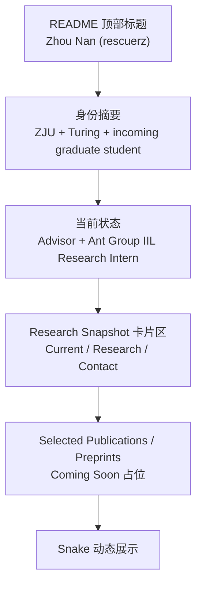

# GitHub 个人主页 README 改版设计

## 1. 结论先行

本次改版目标是把当前偏“装饰型”的 GitHub Profile README，重构为一个更简洁、学术研究导向、英文优先的个人主页摘要页。页面将采用 `Research Snapshot` 风格，以身份信息、当前研究状态、研究兴趣和联系方式为主体，仅保留 `snake` 作为唯一动态展示模块。

同时，现有的 `Metrics` 展示与对应 workflow 将被移除，以降低视觉噪声和维护成本；`profile-3d` 将先从 README 中移出展示，但暂不纳入本轮 workflow 清理范围。

## 2. 背景与现状

### 2.1 当前仓库定位

- 仓库：`rescuerz/rescuerz`
- 类型：GitHub Profile README 特殊仓库
- 当前主要入口文件：`README.md`
- 当前自动化工作流：
  - `.github/workflows/main.yml`：生成 `github-metrics.svg`
  - `.github/workflows/snake.yml`：生成贡献贪吃蛇动画
  - `.github/workflows/profile-3d.yml`：生成 3D contribution 图

### 2.2 当前 README 的主要问题

- 视觉重心偏向统计图和装饰动画，而非研究者身份表达
- 顶部存在重复的 typing banner，信息冗余
- 统计模块过多，包括 `Metrics`、`GitHub Stats`、`Top Languages`、`Activity Graph`、`snake`、`3D contrib`
- 存在空的 `waka` 区块，降低完成度
- “About Me” 信息较旧，未体现当前学术身份、导师、研究实习经历与研究方向

### 2.3 当前 workflow 健康状况

截至 `2026-04-21`，已核查公开运行状态：

- `Metrics` 最近 3 次运行均为 `success`
- `snake` 最近 3 次运行均为 `success`
- `profile-3d` 最近 3 次运行均为 `success`

结论：当前问题不在于 Actions 损坏，而在于 README 信息架构和展示策略不再匹配用户当前阶段。

## 3. 已确认需求

### 3.1 内容定位

- 主页定位：学术研究向
- 语言：全英文
- 风格：简洁、可信、研究主页感更强
- 版式方向：`Research Snapshot`

### 3.2 已确认个人信息

- 展示名：`Zhou Nan (rescuerz)`
- 身份：
  - Zhejiang University 计算机科学与技术本科生
  - 图灵班
  - 浙江大学准研究生 / incoming graduate student
- 导师：Prof. Yongliang Shen
- 当前身份：Research Intern at the Interactive Intelligence Lab of Ant Group
- 研究方向：
  - diffusion language model
  - video generation model
  - world model
- 联系方式：`lemonzjdx@gmail.com`

### 3.3 内容取舍

- 只保留：
  - 身份介绍
  - 研究兴趣
  - 联系方式
  - `Selected Publications / Preprints` 占位
  - `snake`
- 不保留：
  - `Metrics`
  - `GitHub Stats`
  - `Top Languages`
  - `Activity Graph`
  - 空 `waka` 区块
  - 重复 typing banner
  - README 中的 3D contribution 图

### 3.4 workflow 处理策略

- 删除 `.github/workflows/main.yml`
- 保留 `.github/workflows/snake.yml`
- 暂不处理 `.github/workflows/profile-3d.yml`

## 4. 目标结构



## 5. 目标 README 信息架构

### 5.1 顶部标题区

目标：让访问者在第一屏识别出“姓名 + GitHub ID + 学术身份”。

建议要素：

- 主标题：`Zhou Nan (rescuerz)`
- 副标题：一句英文摘要，概括身份与研究方向

建议文案方向：

> Undergraduate in Computer Science and Technology (Turing Class) at Zhejiang University, incoming graduate student at Zhejiang University.

### 5.2 当前状态区

目标：用最短文本明确导师和当前研究实习身份。

建议文案方向：

> Advised by Prof. Yongliang Shen at Zhejiang University. Currently a Research Intern at the Interactive Intelligence Lab of Ant Group.

### 5.3 Research Snapshot 卡片区

采用三块信息卡：

- `Current`
  - Zhejiang University
  - Turing Class
  - Incoming graduate student
  - Research Intern at Ant Group IIL

- `Research`
  - diffusion language model
  - video generation model
  - world model

- `Contact`
  - lemonzjdx@gmail.com

这种拆分方式的好处是：

- 比纯段落更易扫读
- 比大量徽章更克制
- 比传统“About Me + bullet list”更像研究主页

## 6. README 文案草案

以下为接近最终实现的英文文案草案，后续可在实现时微调：

```md
# Zhou Nan (rescuerz)

Undergraduate in Computer Science and Technology (Turing Class) at Zhejiang University, incoming graduate student at Zhejiang University.

Advised by Prof. Yongliang Shen at Zhejiang University. Currently a Research Intern at the Interactive Intelligence Lab of Ant Group.

## Research Snapshot

- **Current**: Zhejiang University undergraduate in Computer Science and Technology (Turing Class); incoming graduate student at Zhejiang University; Research Intern at the Interactive Intelligence Lab of Ant Group.
- **Research**: diffusion language model, video generation model, world model.
- **Contact**: lemonzjdx@gmail.com

## Selected Publications / Preprints

Coming soon.
```

## 7. 产物与 workflow 变更设计

### 7.1 README 保留项

- 保留 `snake` 作为唯一动态模块
- 位置放在文案主体之后，作为轻量视觉收尾

### 7.2 README 移除项

- `github-metrics.svg`
- `github-readme-stats`
- `top-langs`
- `activity-graph`
- `profile-3d-contrib`
- 双 typing banner
- 空 `waka` 区块
- 旧的 `Some Links` 徽章区

### 7.3 workflow 变更

- 删除文件：`.github/workflows/main.yml`
- 保留文件：`.github/workflows/snake.yml`
- 暂不修改文件：`.github/workflows/profile-3d.yml`

说明：`profile-3d` 仍会继续运行，但因为不再在 README 中展示，所以其存在不会影响最终页面简洁度。后续如需进一步减负，可在下一轮单独评估是否停用。

## 8. 非目标范围

本轮改版不包含以下内容：

- 新增个人网站、博客、Scholar、CV 链接
- 新增 `Selected Projects`
- 新增真实论文列表
- 修改 `snake` workflow 行为
- 修改 `profile-3d` workflow 配置
- 设计复杂动画、渐变横幅或大面积装饰性 SVG

## 9. 风险与注意事项

### 9.1 内容风险

- 当前尚无 publications，因此该区域只能保留占位，不能伪造内容
- 学术主页风格强调克制，若保留过多图表会破坏整体方向

### 9.2 维护风险

- 若未来邮箱变更，需要同步更新 README
- 若未来学籍阶段变化（如已正式进入研究生阶段），需要更新身份文案

### 9.3 展示风险

- `snake` 是装饰性模块，若未来 GitHub 对外链渲染策略变化，可能影响显示稳定性
- 由于本轮移除了 `Metrics`，将失去一部分自动统计展示，但换来更明确的学术身份表达

## 10. 验收标准

完成后应满足以下标准：

- 第一屏不再出现重复 banner 或大面积统计图
- 访问者能在数秒内获取以下四类信息：
  - 你是谁
  - 你现在在哪个学术阶段
  - 你在研究什么
  - 如何联系你
- README 中仅保留一个动态展示模块：`snake`
- `.github/workflows/main.yml` 被移除
- README 文字整体为英文

## 11. 后续实现边界

下一阶段实现只应覆盖：

- 编辑 `README.md`
- 删除 `.github/workflows/main.yml`
- 验证 `snake` 资源引用仍可用

不应在未经再次确认的情况下扩展到：

- 新增更多公开链接
- 补充项目列表
- 补充论文列表
- 清理 `profile-3d` 的 workflow
